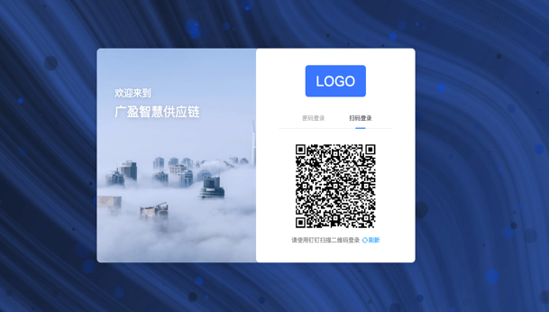
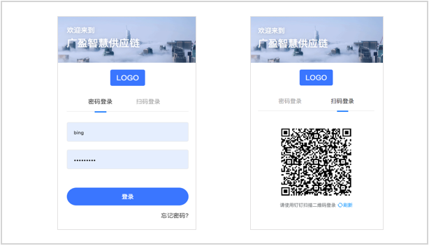
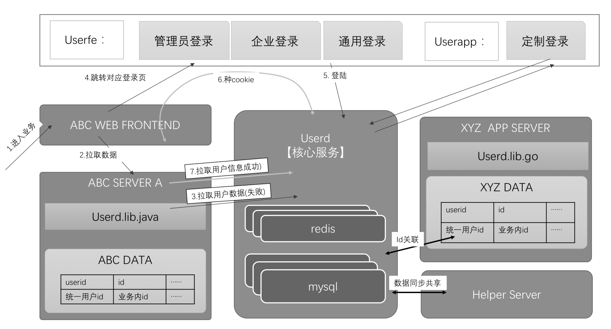

------------
### 概述

通用用户系统，又名USERD系统（USERD即是“user deamon”的缩写），是一款全新的开源用户系统。其旨在为初创团队提供一款完备、稳定、可自由定制的、伸手即得的用户系统，减少重复劳动，增强系统的可交互性。

### DEMO

* 系统示例桌面端截图

* 系统示例移动端截图

------------

### 功能特性
用户系统作为软件系统的基础子系统，可以说在任何一个软件系统中都具有举足轻重的作用。每一个从零开始的项目的第一步往往就是去构建用户登录、注册、授权等等子系统。USERD项目提供以下功能特性。
- [-] 多种类的前端展示方式，场景自由改造定制；
- [-] 完备的后台管理控制功能，快速部署上线；
- [-] 多种第三方登录（钉钉、微信、账户密码、手机号验证码等）；
- [-] 分库分表设计，可支持千万至亿级用户量；
- [-] 源代码开放，快速响应，稳定可靠

------------
### 结构原理
从组成结构上看，以下部分构成本系统的全部内容：
- [-] 核心用户系统后端服务，提供一套完备的API；
- [-] 一组多套登录页前端，部分含义配套的业务页；
- [-] 中台用户系统管理系统，负责分配和管理场景KEY；
- [-] 数据存储系统字典，含mysql和redis数据结构

核心原理流程如下图所示：

------------
### 互助开发
本项目完全开放，可自由复制分发，也可商用。
欢迎大家一起共同开发维护。
